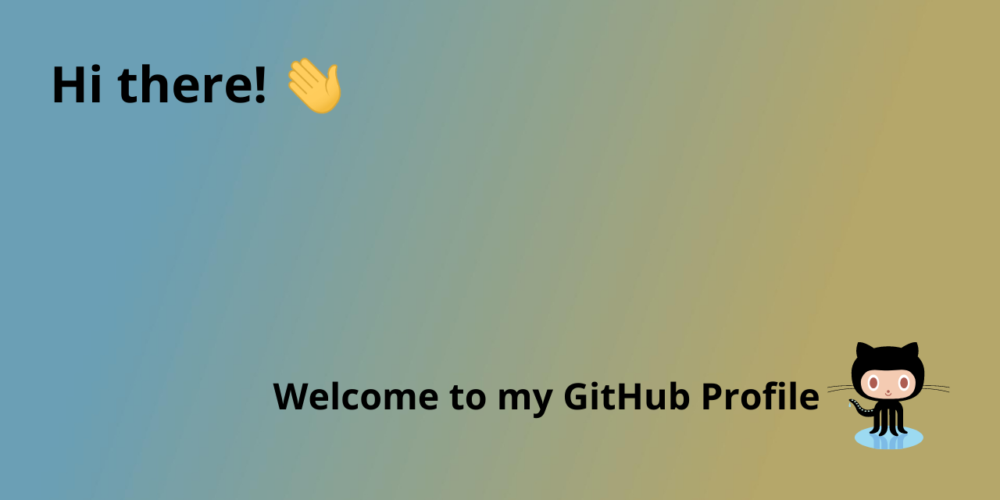

# Tran Huu Truong
-  Hi ! My name is
Tran Huu Truong. I'm from Viet Nam. My dream is to become a software engineer.

-  My goal is to be able to take care of my family life in the future

- Thank you for being here. I wish you all the best
## 👋 About Me

- 🏡 I was born and grown up in **[Ha Nam Province](https://vi.wikipedia.org/wiki/H%C3%A0_Nam)**

- 👨‍🎓 I’m currently learning Software Technology
  
- 👨‍💻 All of my projects are available at **[here](https://github.com/thtruong2904)**

- 📫 How to reach me **tranhuutruong290401@gmail.com**

## 🚀 Languages and Tools:

    <b>Note:</b> Languages and tools which are included below,are only these programming languages & tools I have been and are doing so that they doesn't reflect experience or skill level. 
    
    
    
    
     

## 🏃‍♂️ Github Streak

  
## 🌟 Github Stats

  <b>Note:</b> Top languages is only a metric of the languages my public code consists of and doesn't reflect experience or skill level.

   
    
    
   
  
## 🌎 Connect with me:

## 🪐 Followers

<!-- FOLLOWER-LIST:START -->
<table>
  <tr>
<td align="center">
     
      
     <a href="https://github.com/thtruong2904">Tran Huu Truong</a>
  </td>
		  </tr>
</table>
<!-- FOLLOWER-LIST:END -->

## 
